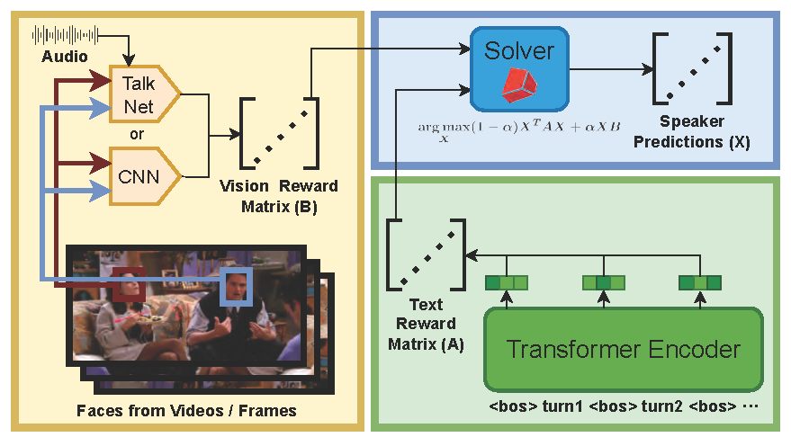

# Baseline Model for Conversation Speaker Identification

## Model Structure


In `csi/` (conversation speaker identification) folder,
- `cnn.py` is the CNN-based model $M_1$,
- `deberta.py` is the transformer-encoder-based model $M_2$,
- `convex_optimization.py` is the problem solver,
- `talknet.py` is the Talknet-based model $M_1$,
- `TalkNet_ASD` is the folder that contains the necessary code to run talknet, which is cloned from [TaoRuijie/TalkNet-ASD](https://github.com/TaoRuijie/TalkNet-ASD).

## Installation
Create a conda environment and and install the python packages
```bash
conda create -n friends-mmc python=3.10
conda activate friends-mmc
pip install requirements.txt
```

## Checkpoints
You can download checkpoints and prediction outputs of all models from [🤗wangyueqian/friends_mmc-speaker_identification](https://huggingface.co/wangyueqian/friends_mmc-speaker_identification).

Please refer to the following instructions in **Usage** section for training and inference.

## Usage
### Visual Model
#### Image as Visual Context
Under the setting that an image is used as the visual context for each turn, we use a fine-tuned CNN as the visual model.
1. First you need to fine-tune CNN on the train set of Friends-MMC:
```bash
# 5 turns
output_path=./snap/cnn/ft-5_turns
mkdir -vp $output_path
nohup python -u ./cnn.py \
    --data_base_folder ../datasets/5_turns \
    --output_path $output_path \
    >> $output_path/train.log 2>&1 &

# or 8 turns
output_path=./snap/cnn/ft-8_turns
mkdir -vp $output_path
nohup python -u ./cnn.py \
    --data_base_folder ../datasets/8_turns \
    --output_path $output_path \
    >> $output_path/train.log 2>&1 &
```

2. Use the fine-tuned model to inference on the test set:
```bash
# 5 turns
output_path=./snap/cnn/ft-5_turns
python ./cnn.py --func test --model_ckpt $output_path/best_model.pth \
    --data_base_folder ../datasets/5_turns \
    --output_path $output_path \
    >> $output_path/test.log 2>&1 &

# or 8 turns
output_path=./snap/cnn/ft-8_turns
python ./cnn.py --func test --model_ckpt $output_path/best_model.pth \
    --data_base_folder ../datasets/8_turns \
    --output_path $output_path \
    >> $output_path/test.log 2>&1 &
```

#### Using TalkNet as visual model
Under the setting that the video is used as the visual context for each turn, we use TalkNet off-the-shelf as the visual model.

We use the video and audio face tracks that are already cropped from the video in `../datasets/face_track_videos`
```bash
output_path=./snap/talknet
mkdir -vp $output_path
python talknet.py --face_track_path ../datasets/face_track_videos \
    --output_path $output_path \
    >> $output_path/test.log 2>&1 &
```

This process produces a frame-level score of whether the face track is speaking. As `../datasets/face_track_videos` contains face tracks for all turns in the dataset, it will get prediction results for both 5 turns and 8 turns.
During "Convex Optimization Problem Solving" stage, these scores will be merged to face-track-level scores by counting how many frames in each face track have scores greater than 0.


### Text Model
1. Train the model on Ubuntu Dialogue Corpus:
```bash
output_path=./snap/deberta/pt-ubuntu_dialogue_corpus
mkdir -vp $output_path
python ./deberta.py --func train \
    --dataset ubuntu_dialogue_corpus --data_base_folder ../datasets/ubuntu_dialogue_corpus --weight_decay 0 \
    --output_path $output_path \
    >> $output_path/train.log 2>&1 &
```

2. Fine-tune the model on Friends-MMC
```bash
# 5 turns
prev_path=./snap/deberta/pt-ubuntu_dialogue_corpus
output_path=./snap/deberta/ft-5_turns
mkdir -vp $output_path
python ./deberta.py --func train \
    --dataset friend --data_base_folder ../datasets/5_turns --weight_decay 0.02 \
    --deberta_model $prev_path/checkpoint-valid \
    --output_path $output_path \
    >> $output_path/train.log 2>&1 &

# or 8 turns
output_path=./snap/deberta/ft-8_turns
mkdir -vp $output_path
python ./deberta.py --func train \
    --dataset friend --data_base_folder ../datasets/8_turns --weight_decay 0.02 \
    --deberta_model $prev_path/checkpoint-valid \
    --output_path $output_path \
    >> $output_path/train.log 2>&1 &
```


3. Use the fine-tuned model to inference on the test set 
```bash
# 5 turns
output_path=./snap/deberta/ft-5_turns
python ./deberta.py --func test \
    --dataset friend --data_base_folder ../datasets/5_turns \
    --roberta_model $prev_path/checkpoint-valid \
    --output_path $output_path \
    >> $output_path/test.log 2>&1 &

# or 8 turns
output_path=./snap/deberta/ft-8_turns
python ./deberta.py --func test \
    --dataset friend --data_base_folder ../datasets/8_turns \
    --roberta_model $prev_path/checkpoint-valid \
    --output_path $output_path \
    >> $output_path/test.log 2>&1 &
```

### Convex Optimization Problem Solver

```bash
talknet_output_folder=./snap/talknet
cnn_output_folder=./snap/cnn/ft-5_turns
deberta_output_folder=./snap/deberta/ft-5_turns

# M1(CNN) + M2 5 turns test
alpha=0.8
python convex_optimization.py --alpha $alpha  \
    --test_cnn_pred_fname $cnn_output_folder/test_output.json \
    --test_deberta_pred_fname $deberta_output_folder/test_output.pkl \
    --test_metadata_fname ../datasets/5_turns/test-metadata.json

# M1(CNN) + M2 5 turns test-noisy
alpha=0.8
python convex_optimization.py --alpha $alpha  \
    --test_cnn_pred_fname $cnn_output_folder/test-noisy_output.json \
    --test_deberta_pred_fname $deberta_output_folder/test_output.pkl \
    --test_metadata_fname ../datasets/5_turns/test-noisy-metadata.json


# M1(TalkNet) + M2 5 turns test
alpha=0.7
python convex_optimization.py --alpha $alpha  \
    --test_talknet_pred_folder $talknet_output_folder \
    --test_talknet_track_folder ../datasets/face_track_annotations/test \
    --test_deberta_pred_fname $deberta_output_folder/test_output.pkl \
    --test_metadata_fname ../datasets/5_turns/test-metadata.json

# M1(TalkNet) + M2 5 turns test-noisy
alpha=0.7
python convex_optimization.py --alpha $alpha  \
    --test_talknet_pred_folder $talknet_output_folder \
    --test_talknet_track_folder ../datasets/face_track_annotations/test-noisy \
    --test_deberta_pred_fname $deberta_output_folder/test_output.pkl \
    --test_metadata_fname ../datasets/5_turns/test-noisy-metadata.json
```
